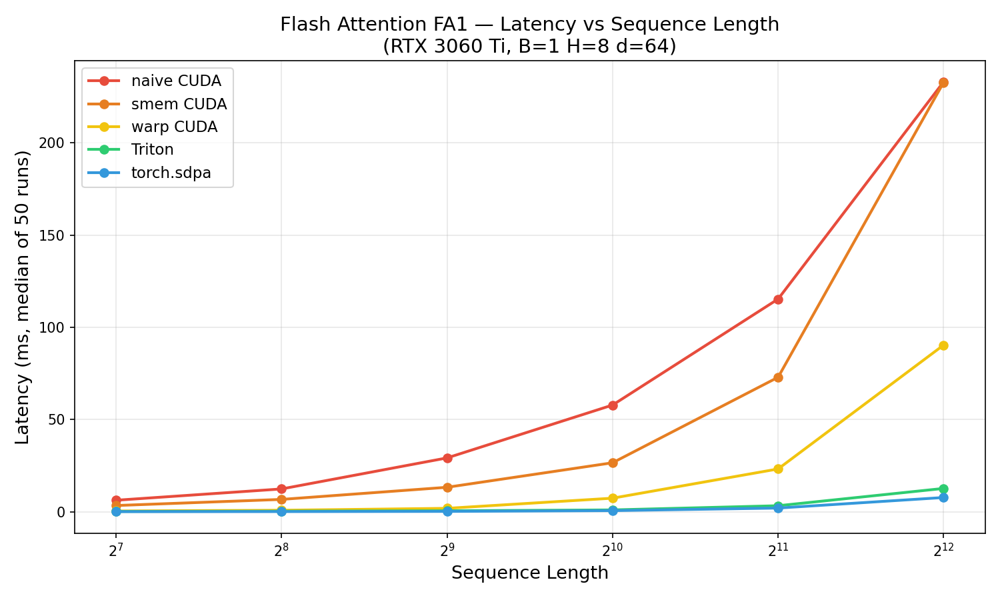
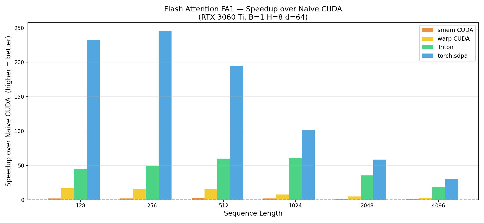

# Flash Attention — CUDA from Scratch

Flash Attention v1 forward pass implemented in three progressive CUDA kernels + a Triton companion, exposed as a PyTorch extension, and benchmarked against `torch.nn.functional.scaled_dot_product_attention` on an RTX 3060 Ti.

---

## The Algorithm

Standard attention materializes an N×N score matrix — **O(N²) memory**. Flash Attention avoids this by tiling Q, K, V into blocks that fit in SRAM and fusing the softmax into the tile loop via an **online softmax** recurrence:

```
for each query tile Qᵢ:
    mᵢ, lᵢ, Oᵢ = −∞, 0, 0
    for each key/value tile Kⱼ, Vⱼ:
        Sᵢⱼ  = Qᵢ Kⱼᵀ · scale       # (Br, Bc) scores — never stored in full
        m_new = max(mᵢ, rowmax(Sᵢⱼ))
        α     = exp(mᵢ − m_new)       # rescale old accumulator
        β     = exp(Sᵢⱼ − m_new)      # unnorm probs for this tile
        lᵢ    = α·lᵢ + rowsum(β)
        Oᵢ    = (α·lᵢ·Oᵢ + β Vⱼ) / lᵢ
    O[Qᵢ rows] = Oᵢ
```

Memory: **O(N²) → O(N)**. HBM reads: **O(N²d) → O(N²d / M)** where M = SRAM size.

---

## Kernel Progression

| Kernel | Key technique | Purpose |
|--------|--------------|---------|
| `csrc/flash_attn_v1_naive.cu` | One thread per row, global memory | Correct CUDA baseline; exposes O(N²) read cost |
| `csrc/flash_attn_v1_smem.cu` | `BR=BC=32` tile cooperative load into `__shared__` | IO-aware speedup: Kⱼ/Vⱼ loaded once per tile |
| `csrc/flash_attn_v1_warp.cu` | One warp per row, `__shfl_down_sync` dot product | Qᵢ in registers; dot product parallelized across 32 lanes |
| `fa_triton/flash_attn_triton.py` | `tl.dot` + unnormalized accumulator | Python-native; readable algorithmic companion |

All three CUDA kernels share the same interface and are registered under a single PyTorch extension (`flash_attn.forward_naive`, `flash_attn.forward_smem`, `flash_attn.forward_warp`).

---

## Benchmarks (RTX 3060 Ti · B=1 · H=8 · d=64)

### Latency vs Sequence Length


### Speedup over Naive CUDA


---

## Build & Run

**Requirements:** PyTorch ≥ 2.0 with CUDA 11+, Triton, matplotlib, numpy. GPU with sm_86+ (RTX 30-series / A-series).

```bash
cd flash_attention

# Build CUDA extension
pip install -e .

# Verify correctness of all 5 variants
python verify.py

# Benchmark all variants and save figures/
python benchmark.py
```

Expected `verify.py` output:
```
Config: B=1 H=1 N=64 d=32 mask=none
  [PASS] Python FA1                  max_err=0.00e+00
  [PASS] CUDA naive                  max_err=<1e-5
  [PASS] CUDA smem                   max_err=<1e-5
  [PASS] CUDA warp                   max_err=<1e-5
  [PASS] Triton                      max_err=<1e-5
...
All tests passed.
```

---

## Repo Layout

```
flash_attention/
├── csrc/
│   ├── flash_attn_v1_naive.cu   # Stage 1: global memory
│   ├── flash_attn_v1_smem.cu   # Stage 2: shared memory tiling
│   ├── flash_attn_v1_warp.cu   # Stage 3: warp-level dot product
│   └── bindings.cpp            # PyTorch extension entry point
├── fa_triton/
│   └── flash_attn_triton.py    # Triton kernel (no build step)
├── setup.py                    # CUDAExtension build (-arch=sm_86)
├── verify.py                   # Correctness gate
├── benchmark.py                # Timing sweep + figures
└── figures/                    # Committed benchmark plots
```

The `flash_attention.py` at the repo root is the pure-Python algorithmic reference these CUDA kernels are translated from.

---

## What's Next

- **Flash Attention v2** — reorder outer/inner loop (query-first parallelism), eliminate inter-warp reductions, increase occupancy. Closer to what `torch.sdpa` uses internally.
- **Backward pass** — recompute softmax from saved `(m, l)` statistics; avoids storing the N×N matrix during training.
- **FP16 / BF16** — `half2` vectorized loads, Tensor Core `mma.sync` for `Q @ K^T` and `P @ V`.
